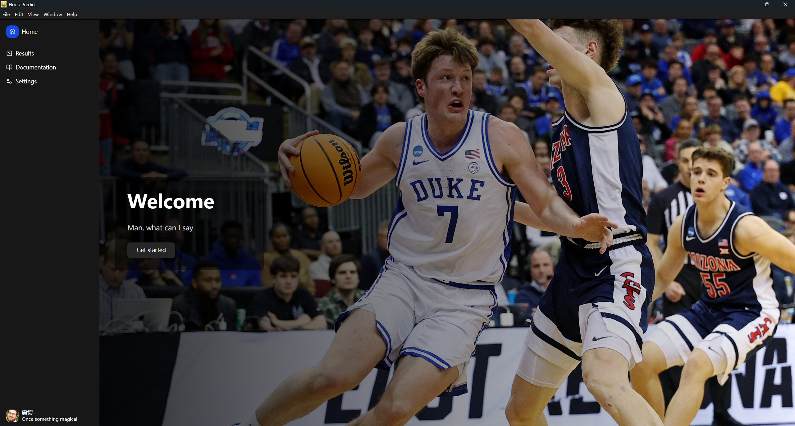
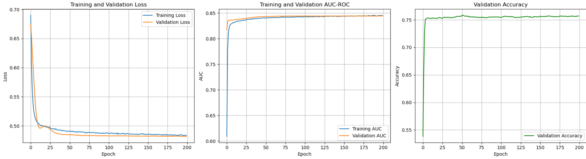

# Hoop Predict

This project implements an ensemble machine learning system for predicting NCAA basketball match outcomes, achieving approximately 75% accuracy through a combination of XGBoost, CatBoost, and neural network models.
### To use the application, go to Releases on right panel and then download the hoop-predict-1.0.1.Setup.exe
### Otherwise, you can build it from source. Check Installation Prerequisites 

The weights of the trained models can be found at  *model_building/trained_models*

<p align="center">
  
  <br>
  <em>Figure 1: The home page of the application</em>
</p>

---

## Data Collection

### Data Sources
The project aggregates metrics from two primary sources:
- **Kenpom**: Comprehensive basketball analytics platform
- **Massey Ratings**: Collection of various ranking systems
- **Kaggle Dataset**: Calculated ELO rating for each team in each season from the dataset.

### Data Standardization Challenges

#### Team Name Matching
A significant challenge involved reconciling inconsistent team naming conventions across data sources. Issues included:
- Format variations (e.g., "Saint" vs "St")
- Completely different names for identical teams across sources
- No automated solution available for standardization

**Solution**: Manual correction combined with source-specific logic rules. While time-intensive, each source maintained internal consistency, allowing programmatic unification once patterns were identified.

#### Team Identification
Each team was assigned a unique `teamID` from the Kaggle dataset to simplify downstream processing with numeric identifiers.

### Handling Missing Data
Several ranking sources exhibited irregular coverage, failing to include all teams consistently. This created substantial null values in the aggregated dataset.

**Approach**: Rather than imputing with means or placeholder values (which would distort ranking-based metrics), columns containing missing values were dropped entirely from the training dataset.

### Dataset Construction

#### Tournament Results
Match outcomes were sourced from Kaggle, serving as training targets. Only data from 2018 onwards was included to ensure completeness and relevance.

#### Feature Engineering
The training dataset combined match results with team statistics. Basic feature engineering included:
- Calculating pairwise differences for common team features
- This step was necessary because classical ML models lack inherent feature extraction capabilities

---

## Model Training

<p align="center">
  
  <br>
  <em>Figure 2: Loss during training. The Model converged well</em>
</p>

### Initial Experiments

#### Model Selection
Started with **XGBoost** and **CatBoost** for rapid prototyping due to their:
- Quick training times
- Built-in feature selection mechanisms
- Ability to ignore irrelevant features automatically

#### Classification vs Regression
Initial regression model attempts failed, as expected for this classification task. Switching to classification variants produced acceptable results.

### Hyperparameter Optimization
Utilized Scikit-learn's `GridSearchCV` for systematic hyperparameter tuning. While performance improvements were minimal, they provided measurable gains over baseline configurations.

### Neural Network Implementation

#### Architecture Considerations
With only 81 input features, a simple neural network could be trained efficiently on a single RTX 3080 within minutes.

#### Feature Scaling
Neural networks require normalized inputs to prevent magnitude bias. For example, a model predicting salary shouldn't weight a $40k salary more heavily than 20 years of experience simply because 40,000 > 20.

**Note**: Tree-based models (XGBoost/CatBoost) have inherent feature scaling capabilities, so this step was unnecessary for those algorithms.

#### Performance
The neural network achieved comparable accuracy (~75%) to the boosting models.

#### Model Persistence
- Trained for 200 epochs with 10 checkpoints saved
- Selected the checkpoint with highest validation accuracy for production
- Saved the scaler using `joblib` to ensure consistent preprocessing during inference

#### ONNX Format
All models were converted to ONNX format for maximum cross-platform compatibility.

**Conversion Process**:
- **CatBoost**: Straightforward conversion using built-in library support
- **XGBoost & Neural Network**: Required additional configuration and troubleshooting

#### GPU Acceleration Decision
Initially included CUDA inference support, but ultimately removed it because:
1. CPU inference was sufficiently fast
2. Requiring CUDA Toolkit and cuDNN installation would complicate setup unnecessarily

### Ensemble Strategy
The final prediction averages outputs from all three models to reduce variance and improve robustness.

---

## Performance

The ensemble achieves approximately **75% accuracy** on match predictions. While this may seem modest, it represents strong performance given:
- The inherent unpredictability of sports outcomes
- Numerous unquantifiable factors affecting game results
- The complexity of tournament dynamics

The model provides reliable probabilistic predictions while acknowledging the limitations of purely statistical approaches to sports forecasting.


## Installation Prerequisites

Before starting, ensure you have the following installed on your system:

- **Git Large File Storage (Git LFS)**  
  This project uses Git LFS to manage large files. To clone and work with the repository correctly, Git LFS must be installed on your machine.

  ### Install Git LFS
  -Download and run the installer from [https://git-lfs.github.com](https://git-lfs.github.com) or use Chocolatey:  
    ```
    choco install git-lfs
    ```

- **Node.js 18 or newer (includes npm)**  
This project requires Node.js version 18 or higher. [Download Node.js](https://nodejs.org/) if you don't have it installed.


## Getting Started

1. **Clone the repository:**
 ```
 git clone https://github.com/xposm/ncaaUI2
 cd <this-repository>
 ```
> If errors occur during cloning, please check if it is Git LFS related, and make sure to have it set up correctly.

2. **Install Vite and other dependencies:**
 ```
 npm install
 ```

4. **Run the development server:**
You can now start the Vite dev server with:
 ```
 npm run dev
 ```
